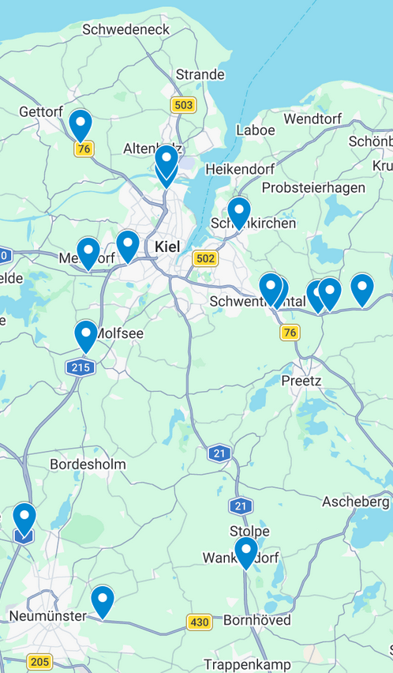

# Data-Science-Project Group-16

## Introduction

### Who we are

We are a group of four students from the Christian-Albrechts-University to Kiel (CAU) studying computer science and business informatics.
This project is assigned to the Data-Science-Project which is taking place between the fifth and sixth semester (Feb 23 - Mar 20, 2026).

We had to find a topic which is interesting to us and perform data science on it:
from the collection of raw, non-pre-processed data, through data cleansing and analyzing, to the creation of visualizations for our findings, which should then be accessible on a self-programmed website.

*All of us are native German speakers, so please excuse the maybe non-perfect English :)*

### The Topic
The topic of our project is as follows: The Personal Traffic around Kiel in the past five years *(2021 to 2025)*.

We developed eight plus one bonus [research questions](Research-Questions.pdf) we want to answer with this project.

### The Data 
The data we used is freely available and is stored [here](https://cloud.rz.uni-kiel.de/index.php/s/PZc2LfZtbB4mPQm). The sources are the following:
- [BASt datasets for the vehicle counts on German Autobahnen (motorways) and Bundesstraßen (federal highways)](https://www.bast.de/DE/Publikationen/Daten/Verkehrstechnik/DZ-Richtung.html?nn=427910)
- [Description of the BASt datasets](https://files.bast.de/public.php/dav/files/TzK6ceAwP9nTnWL/?accept=zip)
- [KBA datasets for the vehicle registration count in Kiel](https://www.kba.de/DE/Statistik/Produktkatalog/produkte/Fahrzeuge/fz1_b_uebersicht.html?nn=835828)
- [Open-Meteo Weather data in Kiel](https://open-meteo.com/en/docs/historical-weather-api)
- [Open-Meteo Air Quality data in Kiel](https://open-meteo.com/en/docs/air-quality-api)
- [OpenStreetMap Bounding Box data for Kiel](https://nominatim.openstreetmap.org/search)
- [OpenLigaDB Football data for games in the Bundesliga 1/2 played in Kiel](https://openligadb.de)
- [Kieler Woche data for visitor count and date](https://www.kieler-woche.de/de/medien/meldung.php)

-----

## Data Pipeline

### BASt Data:
We began by downloading all traffic datasets of the past five years from BASt.de. The data is provided as zip-archives per year for Autobahnen and Bundesstraßen; each of which contains folders with 12 raw-data files and one corresponding metadata file explaining the data. The data is organized in .csv-files. The data is sampled per hour.
As we only consider data for Schleswig-Holstein, we aggregated each data file to only contain rows with information corresponding to Schleswig-Holstein.
To make sure the data is consistent, we also checked if the ID for Schleswig-Holstein in the meta-data stayed consistent over all datasets.
This was done using the script in [this Jupyter Notebook](Code/BASt_Data_Aggregation/BAStDataSHAggregation.ipynb).

In the next step we merged all files into one .csv-file for the entire traffic data of Schleswig-Holstein. On top of that we had to convert the coordinates for the counting stations given in the meta-data files to another encoding, so that they can be used for the API requests on weather and air quality. [Here](Code/BASt_Data_Aggregation/BAStDataKielAggregation.ipynb) you can find the code.  
Next we cut the .csv-files down to the rows only containing info about the [selected counting stations](#selection-of-the-traffic-counting-stations) with [this code](Code/CSV-Transformation/filter_kiel_measuring_points.ipynb).

*For these aggregation files it's important to keep in mind that they may have to be adjusted because of file-names and directory paths on your own machine.*

In an additional step we did some analysis on the data to [check the quality](Code/BASt_Data_Aggregation/DataCleaningSH_data.ipynb) in terms of how many errors are present in the data.  
We detected that counting station #1162 has no values over the entire observation period, so we removed it from our data.  
For all further exploration of the data we will not use entries that contain missing values. We will sort them out during the visualization process. 
We also detected, that for some counting stations there is a high percentage of values flagged as "estimated because of missing value".  
We currently (10.03.26) don't know what is meant with a value being "estimated" because the description of the data states that the data is in its most raw form. We've contacted BASt to explain that and we'll update this ReadMe accordingly.  

*UPDATE* (end of project): We sadly did not receive any answer from BASt for an explanation of the quality flags. We used the data in a way that made up for potential estimated values.


### KBA Data:
The data for yearly vehicle registration counts in Germany is provided in Excel files. The naming of the columns did not stay consistent over the five-year observation span. Thus we had to normalize the columns in each file, so that columns covering the same information have the same name. We did that so we were able to later join all files into one .csv-file. 
We then collected only rows containing information about Kiel registration counts. 
After that the single files got merged into one .csv-file containing all registration counts for Kiel from the years 2021 to 2025.
The code for that can be found [here](Code/CSV-Transformation/KBA_data_combination.ipynb).


### Open-Meteo Weather Data:
We chose the Open-Meteo Weather API to collect historical weather data for the time period from 2021 to 2025. We set up the API and requested data for the following variables:
- daily:
  - weather code
  - temperature mean
  - precipitation sum  


- hourly:
  - weather code
  - temperature
  - precipitation
  - snow depth
  - snow fall
  - wind speed
  - wind gusts
  - relative humidity

We retrieved the hourly data by requesting the values for the location coordinates of our selected BASt counting stations and created one .csv-file for the data.
The same procedure was performed for the daily data.
The code for the API requests is stored [here](Code/API-requests/openmeteo_weather_API.ipynb).


### Open-Meteo Air Quality Data:
We chose to use Open-Meteo as well for our Air Quality data collection by using the Open-meteo Air Quality API to retrieve data for corresponding variables.
A list of the variables we requested from the API can be found [here](https://cloud.rz.uni-kiel.de/index.php/s/2jW9kXWdny9T8td) with an explanation on why we decided that way.
We set up the API and requested hourly data for the selected variables. As we did for the weather data, we retrieved the data by using the coordinates of the BASt counting stations.
A .csv-file containing all data was then created.
[This code](Code/API-requests/openmeteo_airquality_API.ipynb) was used to make the API requests and collect the data.


### OpenLigaDB Data:
For one of our research questions we wanted to show how traffic changes when special events take place. We decided that football matches at the Holstein Stadion would be a great case. We used the OpenLigaDB API to get data about when a match took place there.
For that, we used the knowledge that matches there only take place when Holstein Kiel is playing as the "Home Team". 
In the OpenLigaDB for each match both teams are listed; the first team is always the home team. 
Thus, we collected the data where Holstein Kiel is listed as the first team for each match from 2021 to 2025 in the first and second Bundesliga. We created a corresponding .csv-file containing the information with [this code](<Code/API-requests/openligadb.de API.ipynb>).  

**We ended up not using this data as we adjusted the research questions in a way so that this data is no longer needed.**  


### Kieler Woche Data:
In addition to football matches we wanted to take the Kieler Woche into account as a big event which might influence the traffic around Kiel.
The data we needed is not available via an API nor given in some data files. Therefore we went on the internet and collected these few data points ourselves and wrote them into a .csv-file containing the dates from when to when the Kieler Woche took place from 2021 to 2025, as well as the estimated visitor counts. 

-----

## Merging data together:
To gain a good overview, we merged all data together into one big .csv-file; containing the traffic data, weather and air quality data for the corresponding counting station, at an hourly sampling rate. 
Therefore, all encodings or formats for join attributes had to be normalized.
After joining, we removed all redundant columns from the file as well.
The code can be found [here](Code/CSV-Transformation/holy_file_generator.ipynb).

-----

## Selection of the traffic counting stations
To get a first idea of where the counting stations in and around Kiel are located, we exported one exemplary metadata file from BASt to Google MyMaps
and identified "the most relevant" measuring points by eye and feeling.



Because this is not a scientific way of selecting the measuring points providing data on which the whole project relies on, 
we created a coordinate frame (bounding box) for the Kiel region (+ extra radius for surrounding area) and identified the traffic measuring points that are 
located within this frame.

This coordinate frame has the following coordinates:
- min_latitude: 54.068086300000004
- max_latitude: 54.61594389999999

- min_longitude: 9.8472391
- max_longitude: 10.404307

The data for the bounding box was retrieved from the OpenStreetMap API using the script in [this Jupyter Notebook](<Code/API-requests/openstreetmap.org API.ipynb>).

The counting stations within this frame then got analyzed by us in terms of usefulness for our project.
We selected the following stations as relevant:
- **1104: "Rumohr" on the A215** -> a main route when traveling the North-South-Axis; e.g. it is the direct connection to the A7 from Kiel.
- **1111: "Kiel-Holtenau I" on the B503** -> counting station on the Holtenauer Bridge to count vehicles to the North of Kiel. This station is before a road branches off to Holstein Stadion.
- **1112: "Kiel-Holtenau 2" on the B503** -> counting station next to station #1111 but after the branch to Holstein Stadion. We selected this station as well to have the opportunity to answer questions where the information might be helpful, how many vehicles took the branch.
- **1116: "Gettorf (Wulfshagen)" on the B76** -> the only counting station covering the vehicle counts for the North-West-Axis from Kiel.
- **1135: "Raisdorf I" on the B76** -> the closest of the counting stations in the East of Kiel; and one that was in operation over all five years of the observation period.
- **1156: "AS Wankendorf (Stolpe)" on the A21** -> counting station covering the traffic coming from the East via the Autobahn (e.g. trips from Berlin).
- **1158: "Kiel/Schönkirchen" on the B502** -> only counting station in the North-East of Kiel.
- **1162: "Melsdorf" on the A210** -> counting vehicles on the West-Axis of Kiel. 
- **1194: "Kiel-West" on the A215** -> counting station directly in front of Kiel, where the A215 and A210 merge together.

-----

## Building and Deploying the Website

### Building 
To build the website, we chose the approach that all visualizations will be developed separately from each other in individual Python scripts. During the same time the website interface and structure (homepage, navigation menu, button allocation) got developed as the general layout.  
After each of the files was mostly finalized, they got implemented into the website layout. Small adjustments had to be made for a successful integration, e.g. the correction of file paths or equal layout.

### Deploying
The structure is as follows: While the code is stored in the GitHub repository, the data is saved in a separate NextCloud instance.  
The website gets hosted via Streamlit Community Cloud, which is connected to this repository. The website fetches the data via a public share link from NextCloud and caches it on the server to ensure stable performance. 

-----

## How to use our website

Visit our website: https://dsp-group16.streamlit.app .  

By clicking on the link above you will reach our homepage where you can find an introduction to our topic and a list of all our research questions.  

On the left you can find our navigation menu. From there you can directly visit the page for all used data sources, each research question and the imprint. The sidebar can be folded in, as well as each of the sections it's holding.
There is also a page called "Question Catalog", which gives another, more visually pleasing look of the navigation to each question.  

Click through the questions; for most of them the visualizations are interactive to display the data you want to see.  
Under each figure you'll find a detailed explanation with information and our interpretation of the findings.  

You'll find navigation buttons on the top and bottom of each question page to easily switch between questions.  
Furthermore, the imprint and homepage are easily accessible from every page of the website with buttons on the very bottom.  

Have fun exploring! :)

-----

## The usage of generative AI and Large Language Models

For this project a lot of Python code with Polars and other indispensable libraries had to be written.  
As all of us were mostly unfamiliar with these libraries, we used the help of different LLMs to assist in coding most of the necessary scripts.
We also used these tools for the creation of the website layout with the Streamlit library to quickly retrieve the needed syntax.  

The following models were used for this project:
- Google Gemini: https://gemini.google.com
- ChatGPT by OpenAI: https://chatgpt.com
- Claude by Anthropic: https://claude.ai  

Especially for hosting the website and the necessary efficient data management and loading, we used *Claude* because none of us had ever deployed a website before.  
As a last step, all content in this ReadMe and on the website was checked for **misspelling and grammatical mistakes** using *Google Gemini*.

-----

-----
-----

## Using Anaconda

### Copying an existing Environment

```powershell
conda create --name <envname> --file requirements.txt
python -m ipykernel install --user --name <kernelname> --display-name "<displayname>"
```

### Creating a new Environment

```powershell
conda create --name <name> python=3.11
conda activate <name>
conda install numpy
conda install jupyter
conda install matplotlib
conda install polars
conda install ipykernel
conda install requests-cache
conda install pyproj
conda install streamlit
conda install plotly
pip install openmeteo-requests
pip install retry-requests
python -m ipykernel install --user --name <kernelname> --display-name "<displayname>"
conda list --export > requirements.txt
```

### For updating an Environment to a new requirements.txt

```powershell
conda install --name <envname> --file requirements.txt
```

-----

Thank you for taking a look at our project! 
We really hope you enjoyed it.

All the best from
**Lenn, Felix, Moritz and Anthime**.

